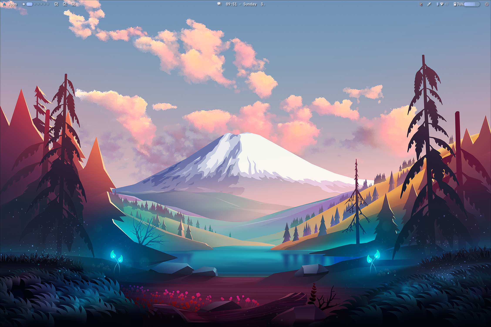
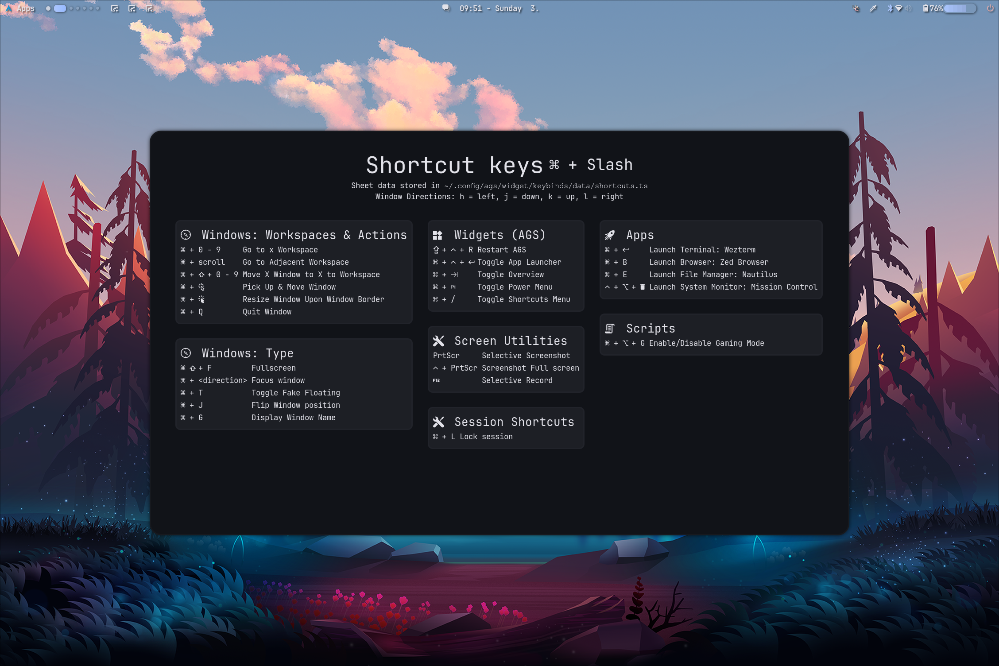
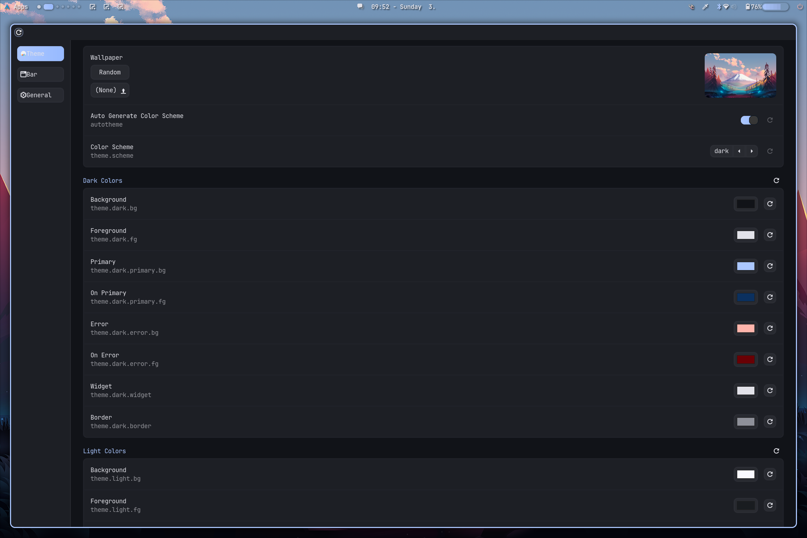

<div align="center">
 <h1>Dotfiles</h1>
</div>

<div align="center">


</a>
</div>
<hr />
<div align="center">
<p>
   A Hyprland configuration set using <a href='https://github.com/aylur/ags'>AGS (Aylur's Gtk Shell)</a>.<br/>
   Can also be used as an automated post-install configuration script.<br/>
</p>

<hr />
</div>

> [!WARNING]
> Laptop workarounds are based on community feedback, and NVIDIA support is noted by Hyprland Wiki to be unofficial but supported with the help of the community.

## Showcase




## Featues

<details>
<summary>Dotfiles</summary>
<br>

- Sane defaults for Pacman
- Clean and minimal configurations for fastfetch, ZSH and OMP (Oh-My-Posh)
  - ZSH configuration also includes a command called `rmpmlck` (ReMove PacMan LoCK) to remove the lock file if Pacman is not running.
- Focus on GTK
- Login skin by AGS
  - Uses GreetD as the greeter.
- Material 3 design language
  - Yes, this includes a replica of the Monet engine!
- Sane Hypridle configuration set
  - Inhibits locking in full screen.
  - Pauses all supported players when locked.
    - Player support depends on the player of choice. Most major ones like Spotify and YouTube Music should support this.
- Basic OSDs (On-Screen Displays)
  - Located on the right side of the screen by default for consistency with phones and tablets.
- Mild customizability, with even more tweaks possible inside the config files themselves
  - Hey, at least it's the widest variety of configurations you can get from the GUI! It's like Good Lock on Samsung except it comes bundled out of the box.
- Keyboard shortcuts guide widget
  - Similar to what Ubuntu Unity and Pardus have.
  - Can be invoked with Super+/, much like on Discord.
- Full screen mobile-esque power menu
  - This ain't like KDE but more like, again, Android devices.
- Cute defaults for images
  - ...if you like anime style, that is. You can still change those in configurations, though.
- Many more available and to come!
</details>


<details>
<summary>Scripts</summary>
<br>


- Fully automated
- Granular configuration
<details>
<summary>Prepares the system for the configuration</summary>
<br>

- Updates the system before anything else.
- Makes sure preliminary dependencies are installed.
- Installs the AUR helper of choice.
- (Optional) Sets up Chaotic AUR - A pacman repo for prebuilt AUR packages.
- Generates mirror list using `rate-mirrors-bin` for fastest package installation experience possible.
  - A backup of the previous mirror list is generated should you need to revert back.

</details>

- VM detection - Hyprland needs extra configuration for virtual machines to enforce software rendering.
- Installs GPU drivers where supported.
  - Config review before running is a must! (`group_vars/all.yml`)
  - **__IF YOU HAVE AN NVIDIA GPU NOT SUPPORTED BY THE LATEST DRIVER, YOU MUST AVOID PROPRIETARY DRIVERS SERVED HERE AND FOLLOW ARCH WIKI FOR THE ONE THAT SUITS YOU!__**
- Laptop workarounds
  - Currently only has auto-brightness blacklisting for Framework laptops - The board vendor is detected just in case.
- KVM configuration with 3D accelaration
- Required and optional dependencies for Linux gaming :D
- Full support for Arch Linux, with more on the roadmap.
- More of these! Check the config for most of them!
</details>

## Supported Linux distros

- Arch Linux

## Requirements

1. Get the release you want.
1.1. Stable release (Recommended for end users):
```
bash <(curl -s https://raw.githubusercontent.com/dianaw353/dotfiles/main/dotfiles.sh) stable
```
1.2. Rolling release (Recommended for developers and enthusiasts):
```
bash <(curl -s https://raw.githubusercontent.com/dianaw353/dotfiles/main/dotfiles.sh) rolling
```
2. Head into the `dotfiles` folder and edit the variables in `group_vars/all.yml`

> [!NOTE]
> These defaults were adjusted for my own setup, and there may be quite a few things you might want to change in there.

## Installation

(Optional) Do a dry-run to make sure things go smoothly:
```
ansible-playbook main.yml --ask-become-pass --check
```

The real deal:
```
ansible-playbook main.yml --ask-become-pass
```

You may also run a specific role instead of the entire playbook, which will install and configure only the packages and apps that role contains.
```
ansible-playbook main.yml --ask-become-pass -t role1 [role2 [...]]
```

> P.S. A list of the available roles can be found under the `default_roles` variable inside `group_vars/all.yml`. :3

## To-Do

View [the relevant issues tag](https://github.com/dianaw353/dotfiles/issues?q=is%3Aissue+label%3AFeature+is%3Aopen) for a more comprehensive rough list of To-Dos and upcoming features.

## Layout of the repo

<details>
<summary>Click/Tap to reveal</summary>

- Pre-configuration Tasks
  - Package manager
    - Perform system upgrade if needed.
    - Make sure preliminary dependencies are installed.
    - Install the AUR helper of choice.
    - (Optional) Set up Chaotic AUR.
    - Generate mirror list using `rate-mirrors-bin`.
      - A backup of the existing list will be generated in case you don't like the one generated by this repo.
    - Update `pacman` configuration.
  - VM detection
    - Hyprland requires extra configuration for software rendering, which is a must for VMs.
  - Drivers
    - CPU detection to install the relevant `ucode` in case you skip it during system installation.
    - GPU detection
      - Core 64-bit, 32-bit and multiarch packages for all GPUs
      - Required open-source multiarch graphics drivers and packages for AMD, Intel and NVIDIA
      - Required proprietary multiarch graphics drivers and packages for AMD, Intel and NVIDIA
  - Laptop workarounds
    - Board vendor detection for appropriate workarounds to be applied.
  - System
    - Install required packages
    - Enable SystemD services
      - `systemd-timesyncd.service`
      - `bluetooth.service`
      - `pipewire.service`
      - `pipewire-pulse.service`
      - `wireplumber.service`
    - Fixes
      - GTK window buttons
      - Screen locking
      - Screen sharing using Pipewire
    - Install packages
      - Core system packages
      - Audio server - May only choose either of these, not both.
        - Pipewire
        - PulseAudio
      - Bluetooth
        - Core packages
        - PulseAudio companions
- Core roles
  - AGS
    - Install required packages
    - Configuration
      - Create configuration directories
      - Copy over the configuration files - User profile images included.
      - Enable required services
  - Hyprland
    - Install required packages
    - Configuration
      - Copy over the configuration files
      - Update pre-made configuration files
      - Enable dynamic cursors
  - Install and configure core packages
    - (Optional) Change the default shell
      - Supports only ZSH. Also disables OMP warnings if my config is used.
  - i18n (Internationalization)
    - Install fcitx5 and configure it.
      - The only configuration for now is allowing language switches everywhere.
    - (Optional per language) Install fonts for non-Latin languages. Currently supports the following languages:
      - CJK (Chinese-Japanese-Korean) - Noto
      - Japanese - Official font by the IPA
      - toki pona - linja pona
    - (Optional per language) Install fcitx5 IMEs for non-Latin languages. Currently supports the following languages with their respective packages:
      - Chinese - `fcitx5-chinese-addons`
      - Japanese - `fcitx5-mozc`
      - Korean - `fcitx5-hangul`
      - toki pona - `ilo-sitelen-git`
  - Install custom apps
  - KVM
    - Replace `iptables` with `iptables-nft`
    - Install required packages
    - Enable required services
    - Add current user to `libvirt` group
    - Update `libvirtd` settings
    - Make sure virtual network is started and set it to automatically start on boot
  - VMware
    - Install specified headers package for your kernel (Required for `vmmon` and `vmnet` kernel modules)
    - Install VMware Workstation from AUR
    - Enable USB Arbitrator and Networks services
  - Install required packages and optimal gaming experience
- Post-configuration Tasks
  - Clear AUR cache

</details>

## Credits

- TechDufus: https://github.com/TechDufus/dotfiles
- Logan Marchione: https://github.com/loganmarchione/ansible-arch-linux
- Dreams of Autonomy: https://github.com/dreamsofautonomy/zensh and https://github.com/dreamsofautonomy/zen-omp
- Aylur: https://github.com/Aylur/dotfiles
- Kotontrion: https://github.com/kotontrion/dotfiles
- Stephan Raabe: https://gitlab.com/stephan-raabe/dotfiles
- And more that I might have forgotten to add...
